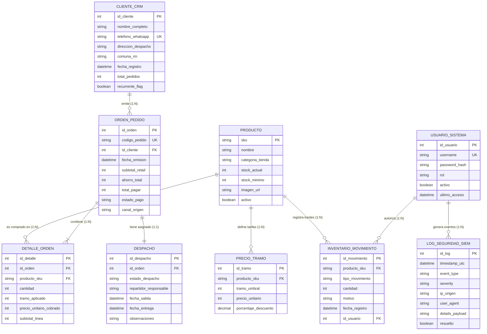

# Data Model: MEGASUPER.CL (3FN Relational Specification)

**Feature Branch**: `001-marketplace-inteligente`  
**Status**: Normalized (Third Normal Form - 3FN)  
**Database Architect**: Rodrigo Bravo (DBA & QA Lead)  

---

## 1. Diagrama Entidad-Relación (DER en 3FN)

---

## 2. Diccionario de Datos Formal (9 Entidades Normalizadas)

### 1. `PRODUCTO`
Catálogo unificado del marketplace 4 en 1.
- `sku` (VARCHAR 50, PK): Código unívoco del producto.
- `nombre` (VARCHAR 255, NOT NULL): Denominación comercial.
- `categoria_tienda` (ENUM: `'ABARROTES'`, `'BEBIDAS'`, `'ASEO'`, `'DISFRACES'`, NOT NULL).
- `stock_actual` (INT, CHECK >= 0, NOT NULL): Existencia física disponible.
- `stock_minimo` (INT, DEFAULT 5): Umbral para alerta de reposición.
- `imagen_url` (VARCHAR 500): Enlace al asset fotográfico optimizado.
- `activo` (BOOLEAN, DEFAULT true): Visibilidad en catálogo público.

### 2. `PRECIO_TRAMO`
Normalización en 3FN que erradica la redundancia de columnas fijas de precios.
- `id_tramo` (INT, AUTO_INCREMENT, PK).
- `producto_sku` (VARCHAR 50, FK -> `PRODUCTO.sku`, NOT NULL).
- `tramo_umbral` (INT, NOT NULL): Umbral de activación (1 = Retail, 3 = Mayorista, 6 = Súper Mayorista).
- `precio_unitario` (INT, CHECK > 0, NOT NULL): Tarifa unitaria en $ CLP.
- `porcentaje_descuento` (DECIMAL 5,2): Descuento porcentual frente al precio retail base.
- *Restricción UNIQUE:* `(producto_sku, tramo_umbral)`.

### 3. `INVENTARIO_MOVIMIENTO`
Auditoría Kardex inmutable para control estricto de existencias físicas.
- `id_movimiento` (INT, AUTO_INCREMENT, PK).
- `producto_sku` (VARCHAR 50, FK -> `PRODUCTO.sku`, NOT NULL).
- `tipo_movimiento` (ENUM: `'ENTRADA'`, `'SALIDA'`, `'AJUSTE'`, NOT NULL).
- `cantidad` (INT, NOT NULL): Cantidad transferida.
- `motivo` (VARCHAR 255, NOT NULL): Justificación operativa.
- `fecha_registro` (DATETIME, NOT NULL, DEFAULT CURRENT_TIMESTAMP).
- `id_usuario` (INT, FK -> `USUARIO_SISTEMA.id_usuario`, NOT NULL).

### 4. `CLIENTE_CRM`
Maestro de clientes y destinatarios capturado durante el Checkout.
- `id_cliente` (INT, AUTO_INCREMENT, PK).
- `nombre_completo` (VARCHAR 150, NOT NULL).
- `telefono_whatsapp` (VARCHAR 30, UNIQUE, NOT NULL): Identificador unívoco del comprador.
- `direccion_despacho` (VARCHAR 255, NOT NULL).
- `comuna_rm` (VARCHAR 100, NOT NULL): Comuna de Santiago.
- `fecha_registro` (DATETIME, NOT NULL).
- `total_pedidos` (INT, DEFAULT 1): Conteo histórico de compras.
- `recurrente_flag` (BOOLEAN, DEFAULT false): Activo si `total_pedidos >= 2`.

### 5. `ORDEN_PEDIDO`
Cabecera transaccional de venta.
- `id_orden` (INT, AUTO_INCREMENT, PK).
- `codigo_pedido` (VARCHAR 50, UNIQUE, NOT NULL): Identificador público de seguimiento (ej. `MS-2026-9812`).
- `id_cliente` (INT, FK -> `CLIENTE_CRM.id_cliente`, NOT NULL).
- `fecha_emision` (DATETIME, NOT NULL).
- `subtotal_retail` (INT, NOT NULL): Suma teórica sin descuentos.
- `ahorro_total` (INT, NOT NULL): Descuento total por tramos.
- `total_pagar` (INT, CHECK > 0, NOT NULL): Monto final cobrado en $ CLP.
- `estado_pago` (ENUM: `'PENDIENTE'`, `'PAGADO'`, DEFAULT `'PENDIENTE'`).
- `canal_origen` (VARCHAR 50, DEFAULT `'WEB_WHATSAPP'`).

### 6. `DETALLE_ORDEN`
Entidad asociativa muchos a muchos (N:M) que congela las tarifas aplicadas al momento de comprar.
- `id_detalle` (INT, AUTO_INCREMENT, PK).
- `id_orden` (INT, FK -> `ORDEN_PEDIDO.id_orden`, NOT NULL).
- `producto_sku` (VARCHAR 50, FK -> `PRODUCTO.sku`, NOT NULL).
- `cantidad` (INT, CHECK > 0, NOT NULL).
- `tramo_aplicado` (INT, NOT NULL): 1, 3 o 6 según el volumen alcanzado.
- `precio_unitario_cobrado` (INT, NOT NULL): Precio unitario congelado.
- `subtotal_linea` (INT, NOT NULL): `cantidad * precio_unitario_cobrado`.

### 7. `DESPACHO`
Entidad logística en relación 1:1 con la orden.
- `id_despacho` (INT, AUTO_INCREMENT, PK).
- `id_orden` (INT, UNIQUE, FK -> `ORDEN_PEDIDO.id_orden`, NOT NULL).
- `estado_despacho` (ENUM: `'PENDIENTE'`, `'EN_PREPARACION'`, `'EN_RUTA'`, `'ENTREGADO'`, DEFAULT `'PENDIENTE'`).
- `repartidor_responsable` (VARCHAR 100, DEFAULT 'Por Asignar').
- `fecha_salida` (DATETIME, NULL).
- `fecha_entrega` (DATETIME, NULL).
- `observaciones` (TEXT, NULL).

### 8. `USUARIO_SISTEMA`
Gestión de credenciales internas y roles RBAC.
- `id_usuario` (INT, AUTO_INCREMENT, PK).
- `username` (VARCHAR 50, UNIQUE, NOT NULL).
- `password_hash` (VARCHAR 255, NOT NULL): Hash seguro.
- `rol` (ENUM: `'SUPER_ADMIN'`, `'ADMIN_TIENDA'`, `'DESPACHADOR'`, NOT NULL).
- `activo` (BOOLEAN, DEFAULT true).
- `ultimo_acceso` (DATETIME, NULL).

### 9. `LOG_SEGURIDAD_SIEM`
Bitácora inmutable de auditoría perimetral y eventos críticos.
- `id_log` (INT, AUTO_INCREMENT, PK).
- `timestamp_utc` (DATETIME, NOT NULL, DEFAULT CURRENT_TIMESTAMP).
- `event_type` (VARCHAR 100, NOT NULL): Ej. `'ADMIN_AUTH_SUCCESS'`, `'AUTH_LOCKOUT_TRIGGERED'`, `'WAF_XSS_BLOCKED'`, `'INVENTORY_MANUAL_ADJUSTMENT'`.
- `severity` (ENUM: `'INFO'`, `'WARNING'`, `'CRITICAL'`, NOT NULL).
- `ip_origen` (VARCHAR 45, NOT NULL).
- `user_agent` (VARCHAR 255, NOT NULL).
- `details_payload` (TEXT, NOT NULL).
- `resuelto` (BOOLEAN, DEFAULT false).
